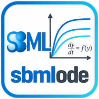

{ width="100" }

# sbmlode

An SBML model describes a system of ordinary differential equations (ODEs), but it is not written as one: the equations follow from the reactions, rules, events and units of the model. `sbmlode` derives this system once and writes it

- as **code** which simulates the model: **python** (numpy and scipy), **julia** (OrdinaryDiffEq.jl) and **R** (deSolve), verified against [libroadrunner](https://libroadrunner.org) over the [SBML test suite](https://github.com/sbmlteam/sbml-test-suite);
- as **documents** which describe the model: **typst**, **LaTeX** and **markdown**;
- as **typed data** for an application which lays out the equations itself, such as [SBML4Humans](https://sbml4humans.de), see [Typed target](typeset.md).

sbmlode depends on [python-libsbml](https://sbml.org/software/libsbml/) and jinja2 only. It is the ODE export of [sbmlutils](https://github.com/matthiaskoenig/sbmlutils) 0.14 as a package of its own, which sbmlutils re-exports as `sbmlutils.converters.ode`.

## Installation

```bash
pip install sbmlode               # the export
pip install "sbmlode[simulate]"   # with numpy, pandas and scipy, which the python code runs with
```

## Quick start

```python
from sbmlode import OdeSystem

system = OdeSystem.from_sbml("model.xml")

code: str = system.render("python")  # the code or document as a string
system.write("model.jl")  # the format from the suffix of the file
system.write("model.md", standalone=False)  # with the options of the format
```

The ODE system of the repressilator of Elowitz and Leibler (BIOMD0000000012), as the markdown fragment writes it:

<div class="doc-rendered" markdown>

--8<-- "images/ode/repressilator_fragment.md"

</div>

The [Guide](formats.md) describes the formats, their options, the supported SBML and the verification, the [API reference](api.md) the classes and functions.

## How to cite

[](https://doi.org/10.5281/zenodo.23179199)

If you use sbmlode please cite the archived software on [Zenodo](https://doi.org/10.5281/zenodo.23179199):

> König, M. (2026). *sbmlode: ordinary differential equations of SBML models* (Version 0.1.0) [Computer software]. Zenodo. https://doi.org/10.5281/zenodo.23179200

```bibtex
@software{koenig_sbmlode,
  author    = {König, Matthias},
  title     = {sbmlode: ordinary differential equations of SBML models},
  year      = {2026},
  month     = oct,
  version   = {0.1.0},
  publisher = {Zenodo},
  doi       = {10.5281/zenodo.23179200},
  url       = {https://doi.org/10.5281/zenodo.23179200},
}
```

## License

sbmlode is open source under the [MIT license](https://github.com/matthiaskoenig/sbmlode/blob/develop/LICENSE). Please [open an issue](https://github.com/matthiaskoenig/sbmlode/issues) for a question or a problem.
